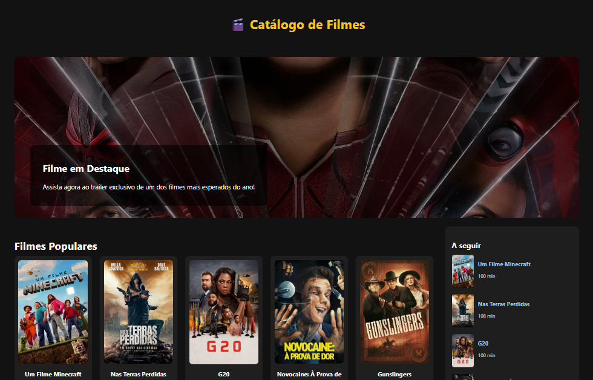
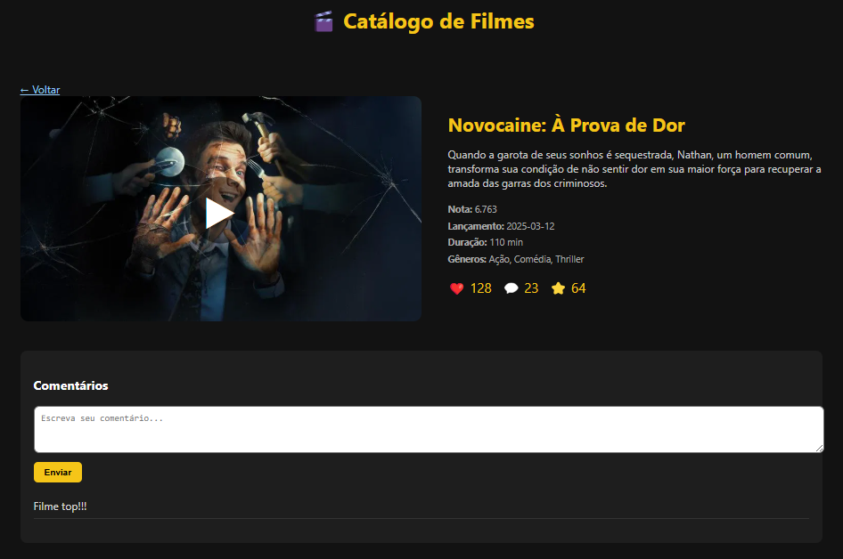

# 🎬 Catálogo de Filmes

Aplicação em React que consome a API do TMDb para exibir um catálogo de filmes populares com detalhes dinâmicos, sistema de comentários e alternância entre temas escuro e claro.

---

## 🚀 Tecnologias utilizadas

- **React**
- **React Router DOM**
- **TMDb API**
- **CSS Modules**
- **LocalStorage**
- **Vercel**

---

## 📸 Prints da aplicação

### 🏠 Página inicial


### 🎥 Detalhes do filme


---

## 🔧 Como executar o projeto

```bash
git clone https://github.com/seu-usuario/catalogo-filmes.git
cd catalogo-filmes
npm install
npm start
```

---

## 🌐 Acesse online

➡️ [Clique aqui para acessar a aplicação no ar](https://catalogo-filmes-delta.vercel.app/)

---

## ✅ Funcionalidades

- [x] Exibição de filmes populares
- [x] Detalhes com rota dinâmica
- [x] Comentários persistentes
- [x] Likes por filme
- [x] Scroll infinito
- [x] Tema claro/escuro dinâmico

---

## 👨‍💻 Autor

Desenvolvido por **Diego de Oliveira Murari Guimarães**  
[LinkedIn](https://www.linkedin.com/in/diego-murari-200a1120a)
